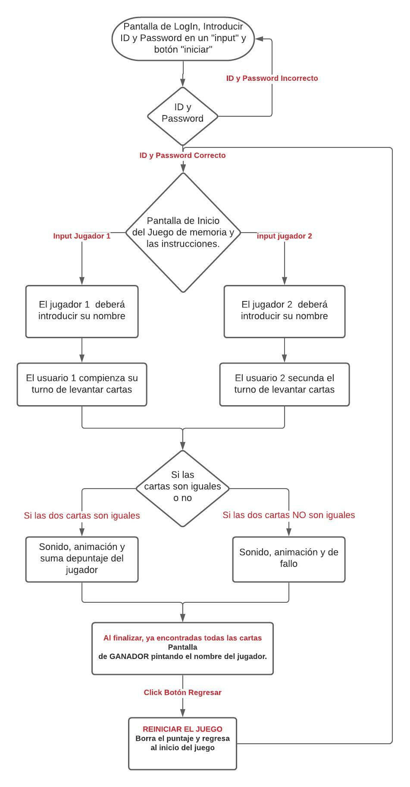

# Memorama 

---
Índice

    1. Descripción 
    2. Necesidades del cliente
    3. App juego de memoria
    4. Diagrama de flujo
    5. Maquetado
    6. Backlog
    7. Pseudocódigo
    
---
## 1. Descripción 

Se nececita una juego de memoria, que permita jugar entre dos jugadores, cada jugador podrá introducir su nombre, el juego calculará su puntuación por turnos, rondas de 3 oportunidades por jugador.

---
## 2. Tipo de Cliente 

Cliente:
El público objetivo es cualquier persona que guste del juego de memoria, principalmente dirigido a jóvenes que gustan del juego de cartas yugioh.

Necesidades:
El usuario busca un juego de memoria que corra desde el navegador, para dos jugadores y que pueda calcular su puntaje para definir un ganador.

---
## 3. Aplicación Juego de Memoria 

Aplicación diseñada para dispositivos móviles y de escritorio, diseñada para premitir jugar desde el navegador a dos jugadores, tomando turnos para poder jugar, y definiendo a un ganador por puntaje. 

---
## 4. Diagrama de Flujo

---
## 5. Maquetado
  
---
## 6. Backlog
  

---
## 7. Pseudocódigo
---
# ReadMe

---

> This Readme should be replaced with the project documentation following the SDLC procedures for Agile Software Development Lyfe Cycle.
